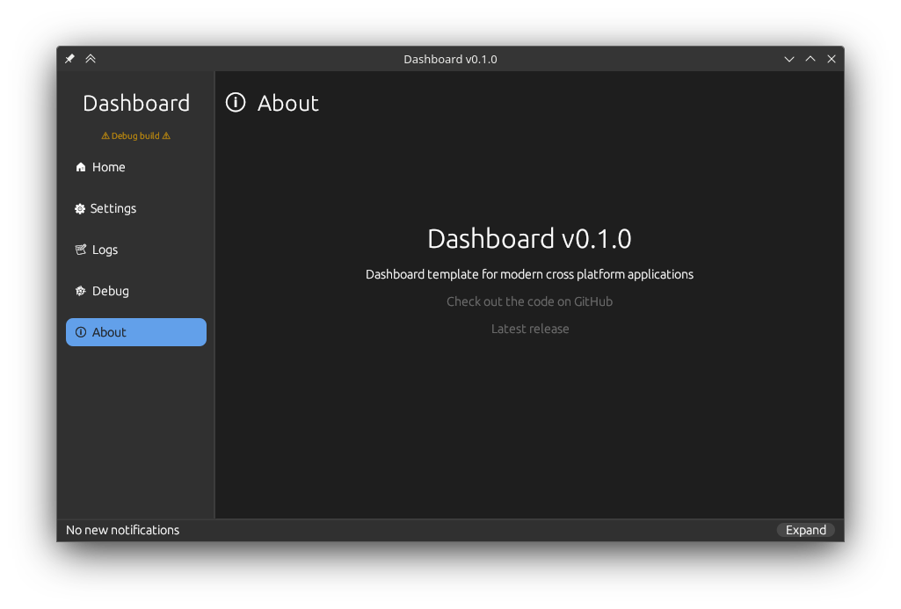
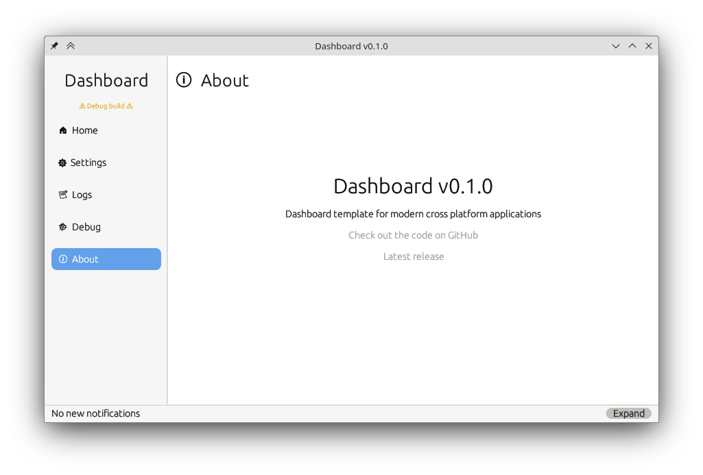

<div align="center">
  <h1>Egui-Aesthetix</h1>
</div>
<br>
<div align="center">
  
  
  
  
  <br>
  <p>A <b>Uniform and Programmatic</b> approach to theming Egui Applications</p>
</div>

## Table of Contents

- [Install](#install)
- [About](#about)
- [Usage](#usage)
- [Maintainers](#maintainers)
- [Contributing](#contributing)
- [License](#license)

## Install

```bash
cargo add egui-aesthetix
```

## About

This library is my answer to theming egui. There are other libraries, and approaches. I like this method because it is trait based,
so many themes could be added to this crate for everyone to use.

By default a Dark and Light theme based off of the [Gnome Adwaita color palette](https://gnome.pages.gitlab.gnome.org/libadwaita/doc/1-latest/named-colors.html) ships with the library. It should look pretty good on Windows, Mac and obviously Linux.

<details>
<summary>Screen Shots</summary>
<br>

<div align="center">
    <h3>Dark Mode on Kde Plasma</h3>
    
    <br>
    <h3>Light Mode on Kde Plasma</h3>
    
</div>

</details>

## Usage

Simple to use, let's implement the [Gruvbox Dark](https://github.com/morhetz/gruvbox#dark-mode-1)
color scheme really quickly.

<details>
<summary>Code</summary>
<br>

```rust
//! main.rs example
use egui_aesthetix::{
    Aesthetix,
    themes::{StandardDark, StandardLight},
};
use eframe::egui;
use std::rc::Rc;

/// Make a struct that represents a color scheme,
/// there should be no need for it to have any fields.
struct GruvboxDark;

/// Implement the Aesthetix Trait for the theme.
impl Aesthetix for GruvboxDark {
    fn name(&self) -> &str {
        "Gruvbox Dark"
    }

    fn primary_accent_color_visuals(&self) -> egui::Color32 {
        // Dark blue: #458588
        egui::Color32::from_rgb(69, 133, 136)
    }

    fn secondary_accent_color_visuals(&self) -> egui::Color32 {
        // Light blue: #83a598
        egui::Color32::from_rgb(131, 165, 152)
    }

    fn bg_primary_color_visuals(&self) -> egui::Color32 {
        // Dark background: #1d2021
        egui::Color32::from_rgb(29, 32, 33)
    }

    fn bg_secondary_color_visuals(&self) -> egui::Color32 {
        // #3c3836
        egui::Color32::from_rgb(60, 56, 54)
    }

    fn bg_triage_color_visuals(&self) -> egui::Color32 {
        // #504945
        egui::Color32::from_rgb(80, 73, 69)
    }

    fn bg_auxiliary_color_visuals(&self) -> egui::Color32 {
        // #665c54
        egui::Color32::from_rgb(102, 92, 84)
    }

    fn bg_contrast_color_visuals(&self) -> egui::Color32 {
        // #928374
        egui::Color32::from_rgb(146, 131, 116)
    }

    fn fg_primary_text_color_visuals(&self) -> Option<egui::Color32> {
        // #fbf1c7
        Some(egui::Color32::from_rgb(251, 241, 199))
    }

    fn fg_success_text_color_visuals(&self) -> egui::Color32 {
        // #8ec07c
        egui::Color32::from_rgb(142, 192, 124)
    }

    fn fg_warn_text_color_visuals(&self) -> egui::Color32 {
        // #fabd2f
        egui::Color32::from_rgb(250, 189, 47)
    }

    fn fg_error_text_color_visuals(&self) -> egui::Color32 {
        // #fb4934
        egui::Color32::from_rgb(251, 73, 52)
    }

    fn dark_mode_visuals(&self) -> bool {
        true
    }

    fn margin_style(&self) -> f32 {
        10.0
    }

    fn button_padding(&self) -> egui::Vec2 {
        egui::Vec2 { x: 10.0, y: 8.0 }
    }

    fn item_spacing_style(&self) -> f32 {
        15.0
    }

    fn scroll_bar_width_style(&self) -> f32 {
        12.0
    }

    fn rounding_visuals(&self) -> f32 {
        8.0
    }
}

fn main() -> Result<(), eframe::Error> {
    let options = eframe::NativeOptions {
        initial_window_size: Some(egui::vec2(320.0, 240.0)),
        ..Default::default()
    };

    eframe::run_native(
        "My egui App",
        options,
        Box::new(move |creation_context| Box::new(MyApp::new(creation_context))),
    )
}

struct MyApp {
    themes: Vec<Rc<dyn Aesthetix>>, // Available themes for user to switch to.
    active_theme: Rc<dyn Aesthetix>, // Currently active theme.
}

impl MyApp {
    #[must_use]
    fn new(creation_context: &eframe::CreationContext<'_>) -> Self {
        let themes: Vec<Rc<dyn Aesthetix>> = vec![
            Rc::new(Gruvbox),
            Rc::new(StandardDark), // Bundled in the library
            Rc::new(StandardLight) // Bundled in the library
        ];

        // The first theme will be the default
        let active_theme: Rc<dyn Aesthetix> = match themes.first() {
            Some(theme) => theme.clone(),
            None => panic!(
                "The first theme in the list of available themes could not be loaded => 'MyApp::new'"
            ),
        }

        creation_context
            .egui_ctx
            .set_style(active_theme.custom_style());

        Self {
            themes,
            active_theme,
        }
    }
}

impl eframe::App for MyApp {
    fn update(&mut self, context: &egui::Context, _frame: &mut eframe::Frame) {
        // Whenever you make a custom frame, we need to manually set the style atributes,
        // not sure why, as every thing else is set.
        egui::CentralPanel::default()
            .frame(
                egui::Frame::none()
                    .inner_margin(self.active_theme.margin_style())
                    .fill(self.active_theme.bg_primary_color_visuals()),
            )
            .show(context, |ui_central_panel| {
                ui_central_panel.heading("Theme Switcher Example");
                ui_central_panel.horizontal_centered(|ui_horizontal_center| {
                    // add combo box to allow the user to select from the available themes in the themes vector
                    ui_horizontal_center.add_space(15.0);
                    ui_horizontal_center.label("Theme:");
                    egui::ComboBox::from_id_source("theme_switching_combo_box")
                        .width(200.0)
                        .selected_text(self..active_theme.name())
                        .show_ui(ui_horizontal_center, |ui_combobox| {
                            for theme in self.themes.iter() {
                                ui_combobox.selectable_value(
                                    &mut self.active_theme,
                                    theme.clone(),
                                    theme.name(),
                                );
                            }
                        });
                });
                // Update the theme with the one the user selected in selectable_value.
                // In a real application you would want this in another tab or something.
                context.set_style(self.active_theme.custom_style());
            });
    }
}
```

</details>

## Maintainers

[@thebashpotato](https://github.com/thebashpotato)

## Contributing

See [the contributing file](CONTRIBUTING.md)!

PRs accepted.

Small note: If editing the README, please conform to the [standard-readme](https://github.com/RichardLitt/standard-readme) specification.

## License

MIT © 2023 Matt Williams
