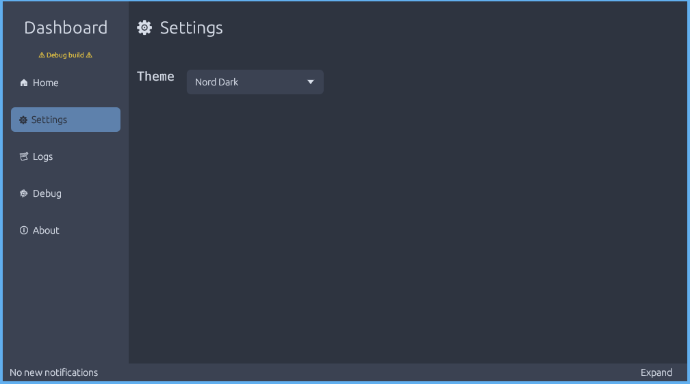
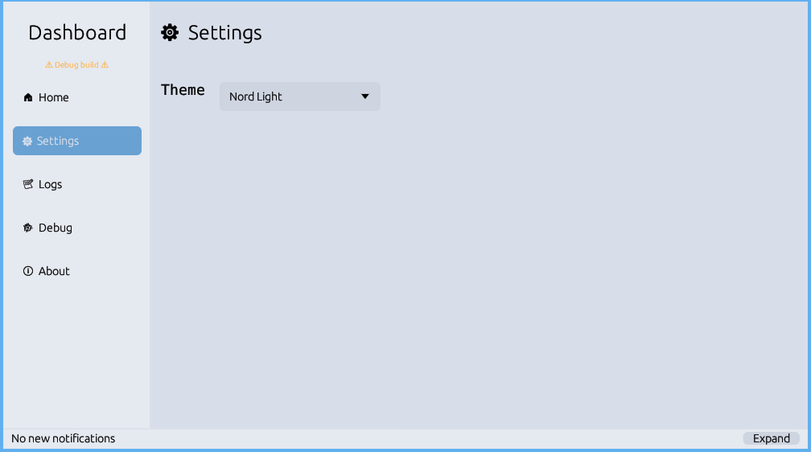
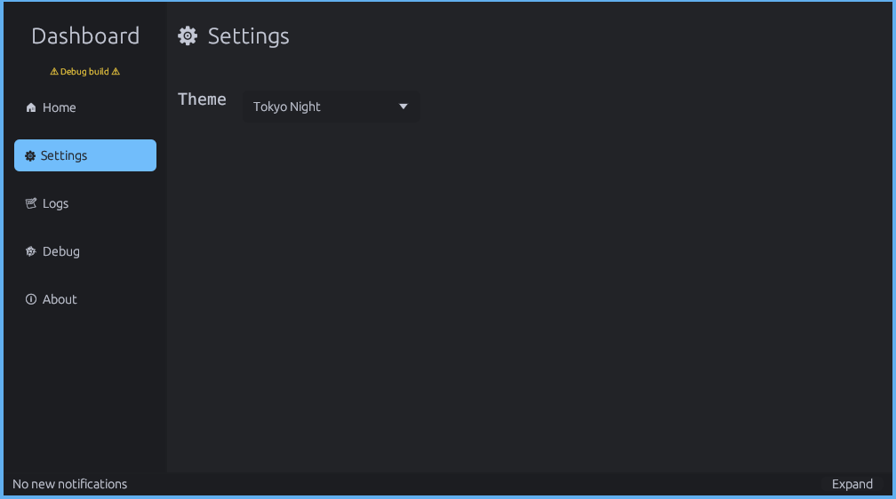
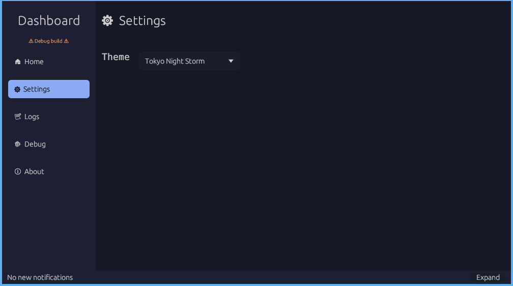

<div align="center">
  <h1>Egui-Aesthetix</h1>
</div>
<br>
<div align="center">
  
  
  
  
  <br>
  <p>A <b>Uniform and Programmatic</b> approach to theming Egui Applications</p>
</div>

## Table of Contents

- [About](#about)
- [Install](#install)
- [Usage](#usage)
- [Maintainers](#maintainers)
- [License](#license)

## About

This library is my answer to theming egui. There are other libraries, and approaches.
I like this method because it is trait based, so many themes could be added to this crate for everyone to use.

### Default themes

> The library ships with the following themes if default features are left on.
> These should look great on Mac, Windows and Linux alike.

1. Standard Dark
    - Based off of the [Gnome Adwaita color palette](https://gnome.pages.gitlab.gnome.org/libadwaita/doc/1-latest/named-colors.html)

2. Standard Light
    - Based off of the [Gnome Adwaita color palette](https://gnome.pages.gitlab.gnome.org/libadwaita/doc/1-latest/named-colors.html)

### Other themes

> There are plenty of other themes that can be specified through features

1. Carl Dark
    - Based off of the [Kde plasma theme](https://store.kde.org/p/1338881/)

2. Nord (Light and Dark)
    - Based off the [ popular Nord theme](https://www.nordtheme.com/)

3. Tokyo Night (Dark and Storm)
    - Based off  the [VSCode Extension](https://github.com/enkia/tokyo-night-vscode-theme)

4. Catpuccin
    - TODO

### Checkout the results

<details>
<summary>Screen Shots</summary>
<br>

<div align="center">
    <h3>Standard Dark theme on Kde Plasma</h3>
    
    <br>
    <h3>Standard Light theme on Kde Plasma</h3>
    
    <br>
    <h3>Carl Dark theme Kde on Plasma</h3>
    
    <h3>Nord Dark</h3>
    
    <h3>Nord Light</h3>
    
    <h3>Tokyo Night</h3>
    
    <h3>Tokyo Night Sorm</h3>
    
</div>
</details>

## Install

The library is very flexible and doesn't force you to include themes you don't want.

> This includes default features which is the Aesthetix trait, and
> the StandardDark and StandardLight themes

```toml
egui-aesthetix = "0.2.4"
```

> Only includes the Aesthetix trait, no themes will be included

```toml
egui-aesthetix = { version = "0.2.4"}
```

> Include all the themes

```toml
egui-aesthetix = { version = "0.2.4", features = ["all_themes"] }
```

> Only include standard themes and a specified theme (here carl is used as the specified theme)

```toml
egui-aesthetix = { version = "0.2.4", features = ["standard", "carl" ] }
```

> Only include nord themes

```toml
egui-aesthetix = { version = "0.2.4", features = ["nord"] }
```

> Only include tokyo night themes

```toml
egui-aesthetix = { version = "0.2.4", features = ["tokyo_night"] }
```

## Usage

Here is the [dashboard template from the above screenshots](https://github.com/thebashpotato/egui-dashboard-template) using this crate for its themes. The code is
straight forward to read. Reading the `egui-aesthetix` source code and the dashboard code
should give you more than enough information and context to use it in your own applications
as well as implement your own custom themes using the `Aesthetix` trait. **Happy Theming!!**

## Maintainers

[@thebashpotato](https://github.com/thebashpotato)

PRs accepted.

Small note: If editing the README, please conform to the [standard-readme](https://github.com/RichardLitt/standard-readme) specification.

## License

MIT © 2023 Matt Williams
